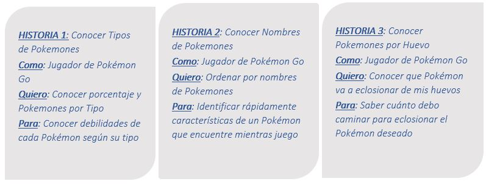
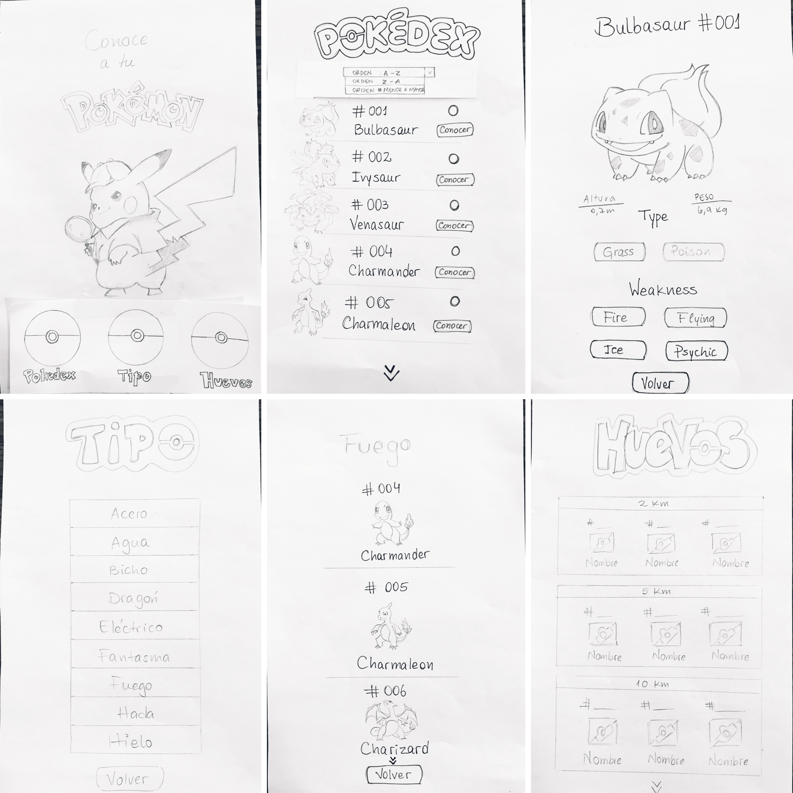

# **Data Lovers**

## **Índice**

* [Presentación](#presentacion)
* [Link PokeGuía](#link-pokeguia)
* [Modo de Uso](#modo-de-uso)
* [Historias de Usuarios](#historias-de-usuarios)
* [Sketch de Solución](#sketch-de-solucion)
* [Test de Usabilidad](#test-de-usabilidad)
* [Diseño de Interfaz](#diseno-de-interfaz)
* [Planificación del Proyecto](#planificacion-del-proyecto)
* [Consideraciones técnicas](#consideraciones-tecnicas)

***

## **Presentación**

**PokeGuía** es una aplicación web , construida para facilitar la búsqueda y visualización de la información principal de cada uno de los 151 Pokémon de la región de Kanto , junto con sus respectivas estadísticas usadas en el juego [Pokémon GO](https://Pokémongolive.com).

## **Link PokeGuía**

Podrás visualizar ésta página web en el siguiente link:
[PokeGuía](https://github.com/paulaestayc/SCL009-data-lovers)<!-- pendiente link final -->

## **Modo de Uso**

En **PokeGuía** no necesitas contar con un registro de usuario para acceder a la información

Una vez que ingresas es posible vizualizar la totalidad de Pokémones de la Región de Kanto

En la barra superior puedes acceder a diferentes tipos de filtro para visualizar de manera más ordenada la información que buscas de cada Pokémon

Existe el "Filtro por Tipo de Pokémon", en el que puedes acceder a las diferentes categorías según los tipos de Pokémones que existen, y al mismo tiempo visualizar el porcenaje correspondiente al tipo seleccionado
 
PokeGuía tambien te brinda la posibilidad de "ordenar los Pokémones" según el Nombre en orden alfabético , de manera ascendiente (desde la A a la Z) o descendiente (desde la Z a la A)

Por último, en "Filtro por huevos" puedes visualizar cuáles son los Pokémones que eclosionarán de acuerdo al kilometraje seleccionado 

## **Historias de Usuarios**

## **Sketch de Solución**

## **Test de Usabilidad**

[Video : Test_Usuario1](https://www.youtube.com/watch?v=eOjUcLrdY8s)

[Video : Test_Usuario2](https://www.youtube.com/watch?v=eC8Un0XFiXc)

Luego de realizar ambos test, obtuvimos feedback positivo , unicamente detectamos que debiamos crear interfaz en español.

## **Diseño de Interfaz**

Es posible ver el Prototipo de Alta Fidelidad en Zeplin en el siguiente 
[Link](https://scene.zeplin.io/project/5cd369262e4f02039b760b5f)

#### **Implementación de la Interfaz de Usuario (HTML/CSS/JS)** 
Muestra la data en una interfaz a través de una tarjeta.
Permite al usuario filtrar y ordenar la data.
Calcula estadísticas de la colección: Total de Pokemones de cada tipo seleccionado.
Se puede visualizar sin problemas desde distintos tamaños de pantallas: móviles, tablets y desktops.

## **Planificación del Proyecto**

Es posible ver la planificación del proyecto en el siguiente [link](https://trello.com/b/J40832iW/pokemon-project)

## **Consideraciones técnicas**
La lógica del proyecto está implementada completamente en JavaScript(ES6), HTML y CSS.

#### **Pruebas Unitarias**
Pruebas unitarias para las funciones encargadas de procesar, filtrar y ordenar la data, así como calcular estadísticas. Estas funciones están presentes en la carpeta data.js y son llamadas desde la carpeta main.js, donde también están presentes las tarjetas tipo y de cada uno de los 151 Pokemon de la región de Kanto.
